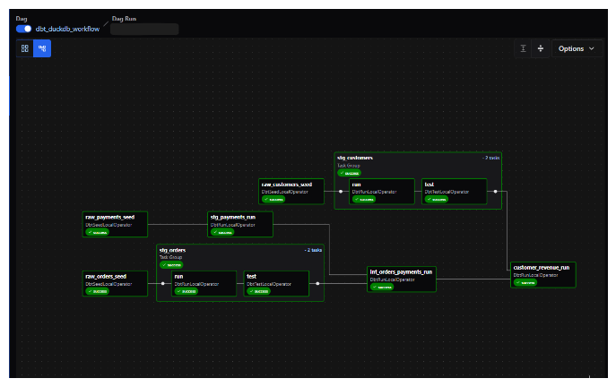
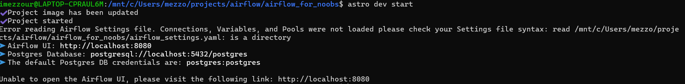
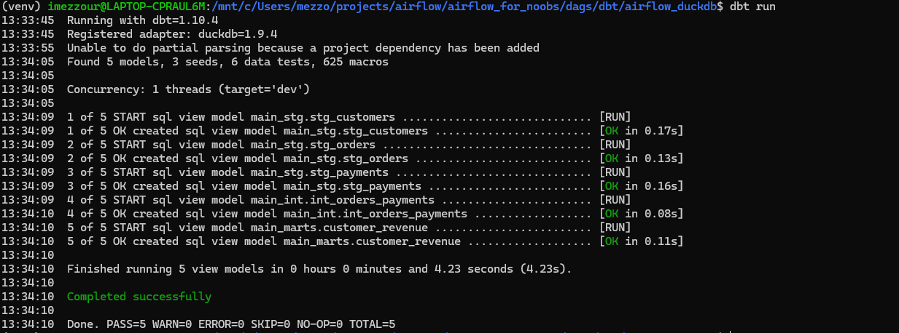
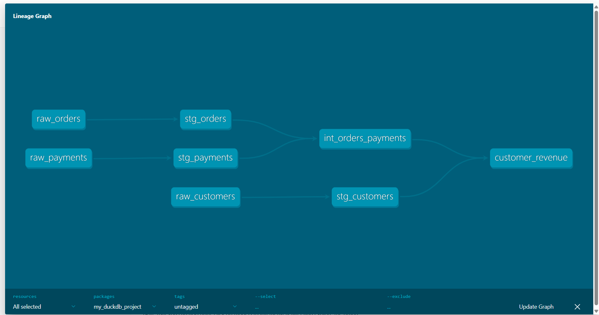
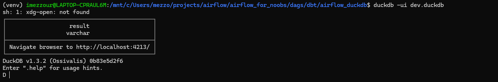
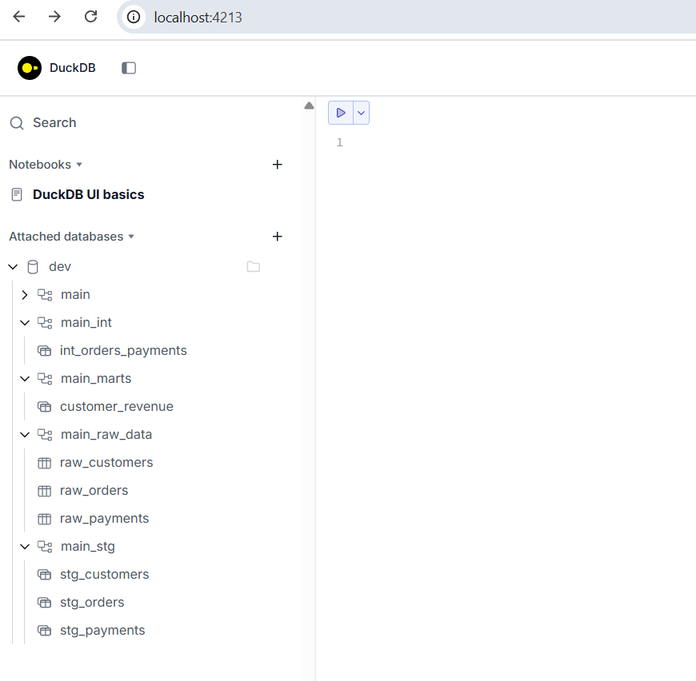
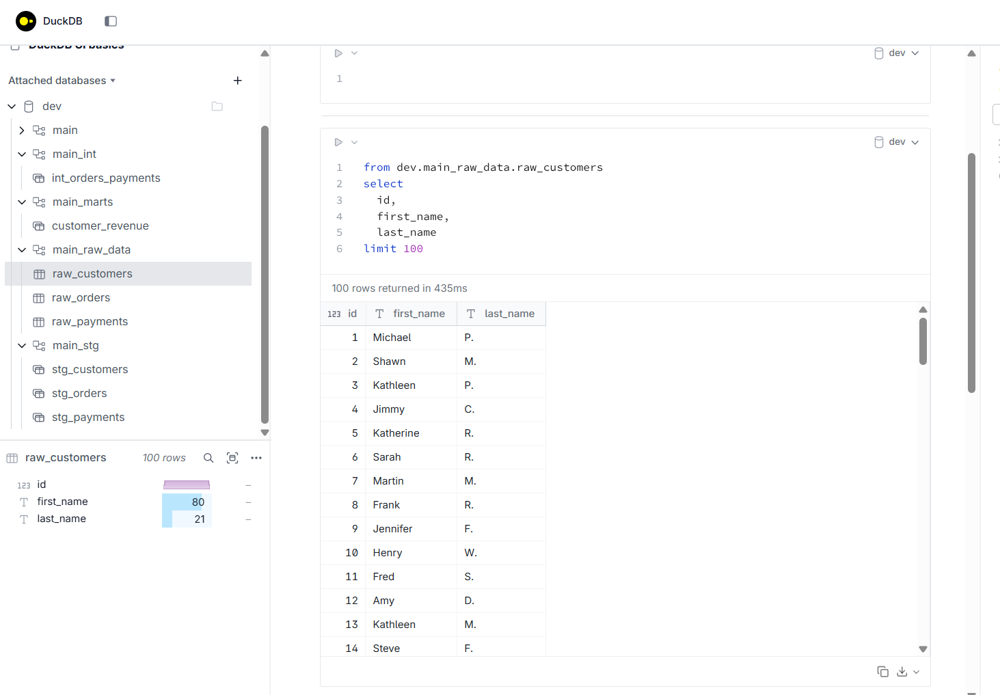

Overview
========
Welcome to the airflow Discovery Project!
(Featuring a simple use case on DBT with DuckDB)
The goal of this project is to share foundational insights about Airflow (using Astronomer) and DBT using duckDB.
This project consists of 3 simple DAGs that you can explore in the following sections.
# Use case presentation

## First example
The first example covers several key concepts that are important when using Airflow.

- **Sensors**: tasks that pause execution until a specific condition or event occurs  
- **Branching**: selecting one execution path based on a Python function’s result  
- **Trigger Rules**: rules that determine when downstream tasks are allowed to run  
- **XComs**: small data messages passed between tasks during a run  
- **Dynamic Task Mapping**: creating multiple task instances from an iterable at runtime  

The flow is illustrated below:

## Automatic dbt dag generation 
With Cosmos( a python package) you can auto-generate a full Airflow DAG from your dbt project without manually wiring task order:

- **Automatic tasks:** one Airflow task per dbt model, seed or snapshot  
- **Inferred dependencies:** Cosmos reads `ref()` calls in your DAG’s `manifest.json`—no need to specify “what runs before what”  
- **Built-in testing:** after every `dbt run`, a corresponding `dbt test` task is added automatically  
- **Configurable execution:** control threads, pragmas, and the `dbt` binary via `ProfileConfig` and `ExecutionConfig`  

For example, you can automatically generate the following DBT DAG using a dag template.

## DAGBag Inspection Overview
This DAG inspects Airflow metadata, automatically reporting:
- total DAGs
- individual task counts
- import errors on dags 

All those task will run in parallel

  

Set up of your environment 
================

## Install astronomer 
- You need docker desktop 
- On linux launch the command: `brew install astronomer/tap/astro`
- To launch astronomer: `astro dev start`:

## Install duckdb

- Launch the installation of duckdb: `brew install duckdb`
- Check if the installation is done `duckdb --version`

## Python environment 

- Create a virtual venv `python3 -m venv venv`
- "Enter" into your venv: `source venv/bin/activate`
- You need to install requirements-dev.txt: `pip install -r requirements-dev.txt` in a virtual venv
- For information: requirements.txt is the one use to build the docker image to build airflow 

## DBT use case 

### Run the models in duckdb
- Go to the dbt folder: `airflow_duckdb` with the command: `dags/dbt/airflow_duckdb`
- Install the dbt dependencies: `dbt deps`
- In order to run your model, use the command `dbt run`

### Generate dbt docs 
In order to generate dbt documentation you have to use the following commands:
  - `dbt docs generate`
  - `dbt docs serve --port 8081`

### Generate notebook to query data 
In order to see all the data available in your database you can open a notebook to query your data.

There you are going to find all the tables/ views that you have created as show bellow:

Now you are able to see all the data you have in your database locally and you are able to query it:

