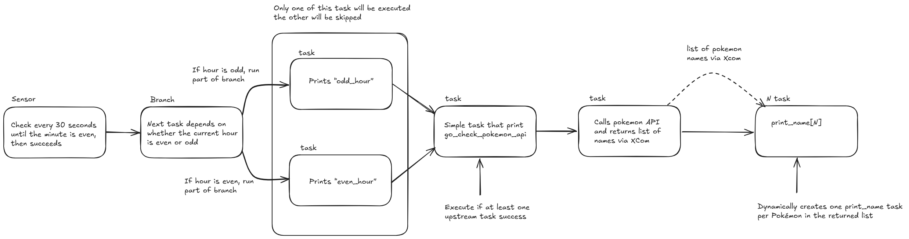
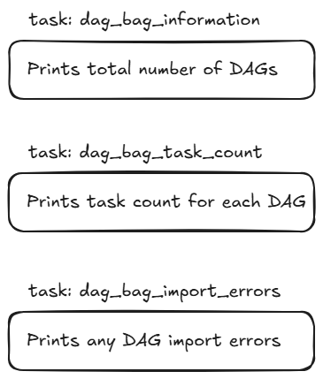

Overview
========
Welcome to to aiflow project discover !
The goal of this project is to share simple notions about airflow via astronomer.

# Use case presentation

## First example
In the first example, we are going to explore:
- sensors
- branching
- trigger rules
- XComs
- dynamic task mapping 

Through the example illustrate bellow:

## DAGBag Inspection Overview
This DAG inspects Airflow metadata, automatically reporting total DAGs, individual task counts, and import errors.
All those task will run in parallel

  

Set up of your environment 
================

## Install astronomer 
- You need docker desktop 
- On linux launch the command: `brew install astronomer/tap/astro`

## Python environment 

- You need to install requirements-dev.txt: `pip install -r requirements-dev.txt` 
- For information: requirements.txt is the one use to build the docker image to build airflow 